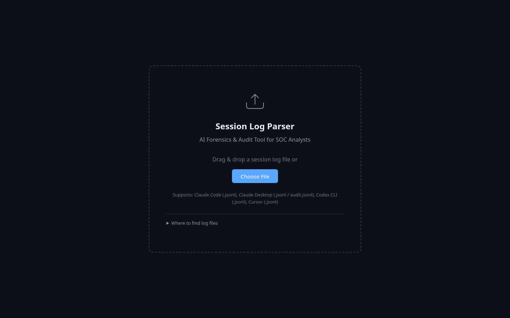
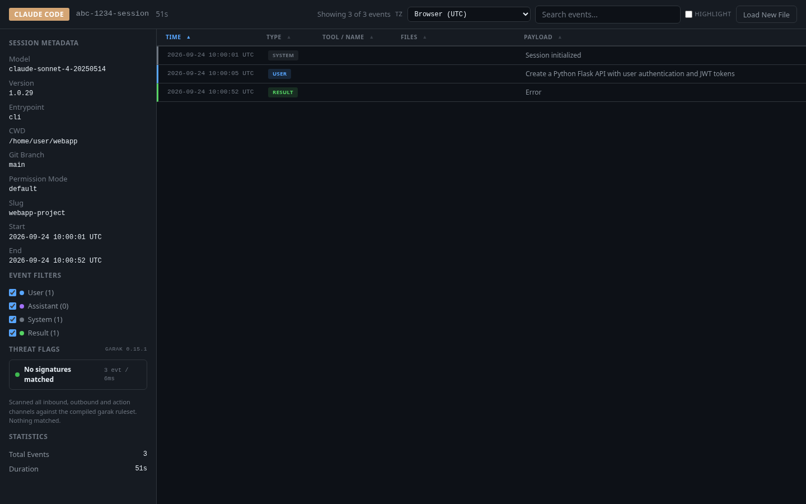
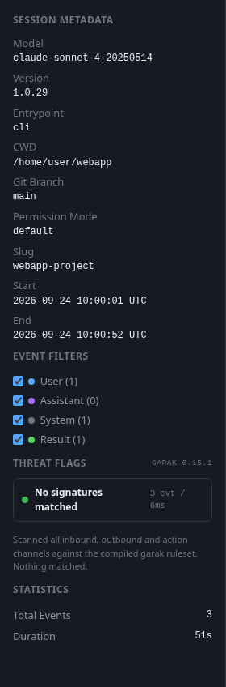
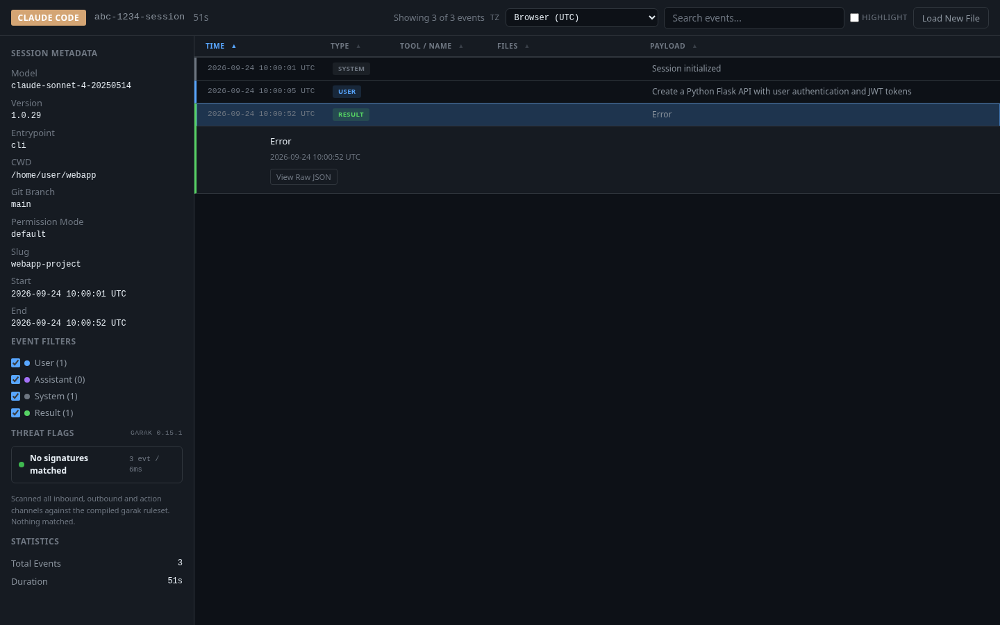
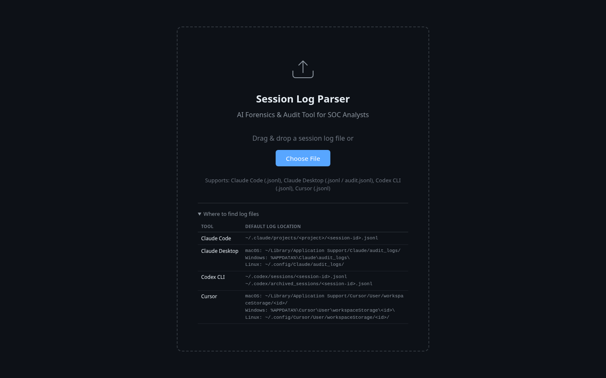

# Agent Log Parser (GarakLite Edition)

A zero-dependency, single-file, browser-based forensics and audit tool for parsing AI coding assistant session logs. Built for SOC analysts, security researchers, and developers who need to inspect what their AI agents actually did.

**No server. No network calls. Your logs never leave your browser.**



---

## Features

### Multi-Format Log Parsing

Parses session logs from all major AI coding assistants:

| Tool | Format | Detection |
|------|--------|-----------|
| **Claude Code** | `.jsonl` | Auto-detected via `permission-mode` / `sessionId` + semver |
| **Claude Desktop** | `.jsonl` / `audit.jsonl` | Auto-detected via audit envelope structure |
| **Codex CLI** | `.jsonl` | Auto-detected via `codex-` session prefix |
| **Cursor** | `.jsonl` | Auto-detected via workspace storage patterns |

### Timeline Viewer

Color-coded, sortable event timeline with column headers for **Time**, **Type**, **Tool/Name**, **Files**, and **Payload**. Click any row to expand full event details with raw JSON inspection.



### Event Types Supported

- **User** messages (blue)
- **Assistant** responses (purple)
- **Tool calls** (orange) &mdash; bash, write, edit, read, etc.
- **Tool results** (green)
- **MCP calls/results** (pink) &mdash; Model Context Protocol interactions
- **Thinking** blocks (gray) &mdash; chain-of-thought reasoning
- **System** events (dark gray)
- **File snapshots** (green) &mdash; tracked file history
- **Attachments** (light blue)
- **Rate limits** (yellow)
- **Result** events (green)

### GarakLite Threat Scanner

Built-in passive security scanner compiled from [garak](https://github.com/NVIDIA/garak) v0.15.1 signatures. Runs entirely client-side with **zero runtime dependencies** on garak.

- **39 rules**, **310 patterns**, **221 tripwire literals**
- Multi-stage scanning: fast literal tripwire pre-filter (Stage A) followed by full regex matching (Stage B)
- Trust-surface-aware: different rules apply to `inbound_user`, `inbound_untrusted`, `outbound_model`, and `action` channels
- **Correlation engine**: detects injection-to-action chains (untrusted input carrying an injection signature followed by a sensitive action without refusal)
- Severity levels: Critical, High, Medium, Low, Info
- OWASP mapping for findings



### Event Detail & Expanded View

Click any event row to expand and see full content, tool inputs/outputs, token usage, and raw JSON. Security flags from GarakLite are shown inline with evidence snippets.



### File Operations Tracking

Automatic detection and display of file operations across all parsers:
- **Added** files (green chips)
- **Modified** files (blue chips)
- **Deleted** files (red chips)

File change summary in the sidebar statistics panel with full path listings.

### Search & Filter

- **Real-time search** with debounced input across all event content
- **Filter mode** (hide non-matching) or **Highlight mode** (keep all, highlight matches)
- **Event type filters** with per-type checkboxes and counts
- **Subagent/sidechain toggle** for sessions with background agents
- **Flagged-only filter** to show only events with security flags

### Additional Capabilities

- **Timezone selector** with full IANA timezone support and localStorage persistence
- **Sortable columns** (time, type, tool, files, payload) in ascending/descending order
- **Session metadata** display: model, version, entrypoint, CWD, git branch, permission mode
- **Statistics panel**: total events, duration, token usage, tool call counts, MCP call counts, files accessed, commands executed
- **Injection detection**: legacy pattern matching for prompt injection indicators (`<system>`, `ignore previous instructions`, etc.)
- **Raw JSON modal**: inspect the original JSON for any event
- **Progressive rendering**: batched DOM updates for large logs (50MB+ support)
- **Responsive design**: adapts layout for screens under 900px
- **Drag & drop** file upload with visual feedback
- **CSP-hardened**: strict Content-Security-Policy header (no external resources)

## Usage

### Quick Start

1. Download `index.html`
2. Open it in any modern browser
3. Drop a `.jsonl` log file onto the upload zone (or click "Choose File")

That's it. No install, no build step, no server.

### Where to Find Log Files

| Tool | Default Location |
|------|-----------------|
| **Claude Code** | `~/.claude/projects/<project>/<session-id>.jsonl` |
| **Claude Desktop** | macOS: `~/Library/Application Support/Claude/audit_logs/` |
| | Windows: `%APPDATA%\Claude\audit_logs\` |
| | Linux: `~/.config/Claude/audit_logs/` |
| **Codex CLI** | `~/.codex/sessions/<session-id>.jsonl` |
| | `~/.codex/archived_sessions/<session-id>.jsonl` |
| **Cursor** | macOS: `~/Library/Application Support/Cursor/User/workspaceStorage/<id>/` |
| | Windows: `%APPDATA%\Cursor\User\workspaceStorage\<id>\` |
| | Linux: `~/.config/Cursor/User/workspaceStorage/<id>/` |



## Architecture

```
index.html (single file, ~180KB)
├── CSS: Dark theme UI with CSS custom properties
├── GarakLite Scanner (IIFE module)
│   ├── Compiled garak ruleset (JSON, 39 rules)
│   ├── Stage A: Fused tripwire regex (~220 literals)
│   ├── Stage B: Per-rule regex/word/literal matching
│   ├── Trust surface channel dispatch
│   └── Correlation engine (injection → action chains)
├── Parser Registry
│   ├── Claude Code / Desktop parser
│   ├── Codex CLI parser
│   └── Cursor parser
├── Event Normalizer & File-Op Detector
├── State Manager (filters, search, sort, timezone)
├── Renderer (progressive batched DOM rendering)
└── Threat Panel (verdict, chain cards, signature list)
```

### Security Model

The scanner maps each event type to a trust surface:

| Event Type | Trust Surface | Rationale |
|-----------|--------------|-----------|
| `user` | `inbound_user` | Direct human input |
| `tool_result`, `mcp_result`, `attachment`, `file_snapshot` | `inbound_untrusted` | Content from external systems |
| `assistant`, `thinking` | `outbound_model` | Model-generated content |
| `tool_call`, `mcp_call` | `action` | Agent executing operations |
| `system`, `rate_limit`, `result` | *(unscanned)* | Transport metadata |

Rules are only evaluated against their designated channels, cutting the candidate set by ~4x before any text matching.

### Cost Model (Why It's Fast)

1. **Channel dispatch** eliminates ~75% of rule candidates per event
2. **Stage A tripwire** (single fused regex of 220 literals) gates 24 of 39 rules
3. **Stage B** only runs for events that pass the tripwire
4. **Budget cap** of 200K chars per event; base64 blobs stripped
5. **Chunked execution** yields to the event loop every 400 events

## Privacy & Security

- **Zero network**: CSP blocks all external connections (`connect-src 'none'`)
- **Zero dependencies**: no CDN, no frameworks, no tracking
- **Client-side only**: files are read via the File API and never transmitted
- **No cookies, no localStorage** (except timezone preference)
- **No images loaded**: `img-src 'none'` in CSP

## Browser Requirements

Any modern browser with ES5+ support:
- Chrome/Edge 80+
- Firefox 78+
- Safari 14+

## License

[MIT](LICENSE)
